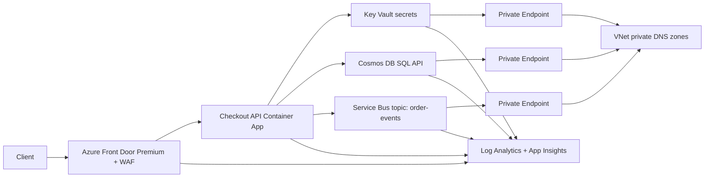

# Checkout flow infrastructure

Bicep modules under this folder provision a private-by-default Azure checkout flow for the Travel Assistant workload.

## Deploy

```powershell
az deployment sub create `
  --location eastus2 `
  --template-file infra\checkout\main.bicep `
  --parameters infra\checkout\parameters\dev.bicepparam
```

For production, use `infra\checkout\parameters\prod.bicepparam`. Override `namePrefix`, `location`, and `containerImage` as needed.

## Architecture



## Network topology

- `aca-subnet`: delegated to `Microsoft.App/environments` for the Container Apps environment.
- `pe-subnet`: private endpoints for Cosmos DB SQL, Key Vault, and Service Bus.
- Private DNS zones linked to the VNet:
  - `privatelink.documents.azure.com`
  - `privatelink.vaultcore.azure.net`
  - `privatelink.servicebus.windows.net`
- Public network access is disabled on Cosmos DB, Key Vault, Service Bus, Log Analytics ingestion/query, and App Insights ingestion/query.

## Managed identity wiring

The checkout API uses a system-assigned managed identity. No app-to-data-plane connection strings or account keys are emitted.

- Cosmos DB: app MI gets Cosmos DB Built-in Data Contributor through SQL RBAC.
- Service Bus: app MI gets Azure Service Bus Data Sender and Data Receiver on the namespace.
- Key Vault: app MI gets Key Vault Secrets User. Container App environment variables use `secretRef` values backed by Key Vault secret references.

The Key Vault secrets `payment-provider-api-key` and `payment-provider-webhook-secret` are placeholder values only. Rotate real values out-of-band after deployment.

## WAF

Azure Front Door Premium is deployed with a WAF policy in prevention mode:

- Microsoft DefaultRuleSet 2.1.
- Microsoft BotManagerRuleSet 1.0.
- Custom rate limit: 100 requests per minute per IP for `/api/checkout/*`.
- Custom bad-bot block rule for common malicious scanner user agents.
- Optional country allow-list through `allowedFrontDoorCountries`.

## Tags and TLS

Every taggable resource includes `workload=checkout`, `env=<dev|prod>`, and `managedBy=bicep`. TLS 1.2+ is enforced for Cosmos DB, Service Bus, HTTPS-only Container App ingress, and HTTPS-only Front Door origin forwarding.

## Rough monthly baseline cost

- Container App: ~$70
- Cosmos DB serverless: ~$50
- Service Bus Standard: ~$10
- Key Vault: ~$1
- Front Door Premium: ~$330
- Log Analytics: ~$30

Baseline total: approximately **$490/month**. Autoscale, telemetry volume, and data transfer will increase cost under load.
